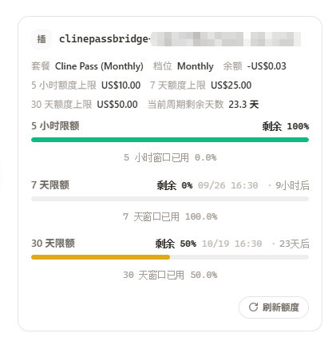

# ClinePassBridge

ClinePassBridge 是 [CLIProxyAPI (CPA)](https://github.com/router-for-me/CLIProxyAPI) 的 Cline Pass 插件。它把 Cline Pass API key 接入 CPA 的凭据系统，提供模型别名、Chat Completions 协议适配、真实 SSE 流及请求观测。首版面向 CLIProxyAPI v7.3.12，发布 Linux amd64/arm64、macOS amd64/arm64 和 Windows amd64 五个平台的动态库。

> **本仓库说明**：本仓库是 [xiao-qiu-qiu/ClinePassBridge](https://github.com/xiao-qiu-qiu/ClinePassBridge) 的独立维护分支（fork），不向上游提交合并请求，两边各自演进。相对上游新增/改进：
>
> - Cline Pass **账号登录**（WorkOS 设备码流程）与令牌自动续期；
> - **额度上报**（依赖宿主的插件额度能力；管理面板需打补丁，见下方「额度」一节）；
> - 插件错误提示中文化。
>
> 仓库公开、按 MIT 协议授权，谁想用谁用。

## 功能

- 支持两种凭据：**API key（推荐）**和 **Cline Pass 账号登录**。**一把 API key 就够** —— 实测它能读 `/users/me`、`/users/me/plan`、`/users/me/plan/usage-limits`，因此**模型请求与额度都走它**，订阅令牌完全不参与（不存在"拿订阅账号反代"的顾虑）。账号登录走 WorkOS 设备码流程（与 Cline CLI 的 `cline auth` 同一条链路），插件自行换取并续期令牌，适合只有订阅、暂时拿不到 API key 的情况。
- 凭据交给 CPA 的 `auth-dir` 保存；插件状态目录不保存凭据。
- 通过 CPA 的额度能力展示 Cline Pass 的套餐、余额与三个滚动窗口的额度上限（**管理面板需支持插件额度**，官方版尚未支持，见下方「额度」一节），也可用插件自带的 `GET /v0/management/clinepassbridge/quota` 直接查看。
- 将客户端模型名映射为指定上游 ID，用户填写的两个名称均原样保存；默认别名 `deepseek-flash` 指向 `cline-pass/deepseek-v4.1-flash`，可在管理页维护其他映射。

  **两个名字的分工**（最容易搞混，务必分清）：
  **左侧「客户端模型名称」= 你在客户端里填的 `model`** —— 宿主按它寻找"哪个凭据能服务这个模型"，所以它**必须**是已注册的名字；
  **右侧「上游模型 ID」= 插件转发给 Cline 的标识**，必须是 Cline 目录里真实存在的 id。
  插件会把**两侧名字都注册**，因此 `deepseek-v4.1-flash` 与 `cline-pass/deepseek-v4.1-flash` 都能请求到（插件的
  `resolveModel` 本来就两种都认，缺的只是让宿主也知道这个名字）。若两个名字都请求不到，宿主会返回
  `auth_not_found: no auth available (… model=…)` —— 那说明这个名字没被注册（改完映射后可用模型行的「测试」按钮验证）。
  额度/备注字段与模型路由无关：凭据的备注只影响列表显示，不参与匹配。
- 非流式支持 `native`（解包 Cline 原生 `success/data`）、`native-fallback`（原生遇到空内容错误时尝试流式聚合）和 `stream-aggregate`（直接由 SSE 聚合）三种模式。默认 `stream-aggregate`，直接聚合上游 SSE 后返回 JSON，跳过原生非流式尝试。
- 流式请求转发为真正的 SSE，处理跨网络分块的事件、用量与终止信号；从上游响应元数据记录实际 provider，缺失时显示“未知”，不根据请求参数猜测。
- 管理页展示凭据、模型映射、请求状态、耗时、用量、实际 provider 和尝试记录。
- “添加模型”弹窗内可获取上游模型；已有的默认映射自动勾选，取消勾选后应用会删除该映射。仅当客户端名称与上游 ID 均完全匹配候选默认值时参与同步，自定义映射保持不变；同名但不同上游的候选会提示冲突。确认时若其他页面已经修改映射，会提示重新获取，避免覆盖。可取消全部默认映射；候选默认使用不带 `cline-pass/` 的客户端名称和目录中的完整上游 ID。之后编辑的名称原样保存，不自动补全或去重前缀。
- 模型添加和编辑使用弹窗，模型删除直接执行。界面跟随同源 CPA 主题，日志提供当前筛选结果的 token 和输入缓存率统计。
- 模型映射里可对单个模型做**连通性测试**：选定一个凭据后发一条最短请求，直接显示通过 / 失败、HTTP 状态、耗时与首字延迟；失败时附上脱敏后的上游响应片段，便于不接客户端就能定位问题。
- 凭据使用添加与编辑弹窗，支持修改备注和 API key；编辑时留空 key 保持原值，页面不回显旧 key。

## 凭据

**推荐直接用 API key** —— 它一个就覆盖模型请求与额度查询，且不参与订阅令牌那条链路：

1. 去 [app.cline.bot](https://app.cline.bot) → **Settings → API Keys** 建一把。
   **创建后立刻复制完整值**：Cline 只在创建那一刻完整显示一次，之后页面上只剩掩码值。
2. 插件控制台「添加凭据」→ 选 **API key** 模式粘贴。

导入时会先用这把 key 打一次 `GET /users/me` 做校验：被上游拒绝（401/403，例如粘到的是掩码值）
**当场报错拒收**，不会存成一条"看似正常、其实永远 401"的凭据。校验通过还会读回账号邮箱，
凭据因此命名成 **`clinepassbridge-key-<邮箱>`**，一眼看出是哪个账号的 key；
同一账号的不同 key 会覆盖同一份凭据（重复粘贴不再新增）。

> **不要两种凭据都留着。** 宿主会在同一供应商的凭据之间调度，两份都在时模型请求可能被分到
> 账号登录那份上去 —— 那就又变成"用订阅令牌发请求"了。**只用 API key** 或**只用账号登录**，二选一。

两种凭据在请求时都表示为一个 `Authorization: Bearer` 值，因此模型、流式转发与日志行为完全一致，
区别只在获取与续期方式：

- **API key**：长期静态凭据，插件不续期，`NextRefreshAfter` 固定为一年后。
- **账号登录**：access token 是有效期约一小时的 JWT，refresh token 长期有效。插件在请求前若发现令牌进入 5 分钟续期窗口会先行续期，同时把续期时间交给 CPA，由宿主按需调用 `auth.refresh`。续期失败不会中断请求，真实失败会以上游错误记入请求日志。

上游只接受带 `workos:` 前缀的令牌；该前缀是 Cline 的存储标记，插件会原样保留。这两点以及续期接口的请求形状都由真实账号实测确认。

## 额度

额度来自三个只读元数据接口，均以同一枚凭据访问（**API key 与账号令牌都行**，实测 API key 能读全部三个），实测只需三次请求：

| 接口 | 用途 |
|---|---|
| `/users/me/plan` | 套餐名、当前周期、三个滚动窗口的上限 |
| `/users/me/plan/usage-limits` | 三个窗口的 `percentUsed` 与 `resetsAt`（已用比例由上游直接给出） |
| `/users/{id}/balance` | 余额 |

其中 `/users/me/plan` 只提供套餐名、窗口上限与当前周期：某些凭据读不到它时，插件只是少报这几项，
**三个窗口照常显示**并记一条日志，不会让整个额度查询失败。

额度与校验请求对传输层抖动（`EOF`、连接重置）以及 408 / 429 / 5xx **自动重试 3 次**
（退避 300ms / 600ms），其余 4xx 立即返回 —— 与 CommandCodeBridge 同一套规则。

两个金额单位不同，均已实测确认：`balance` 的单位是 **1e-6 美元**（网页端把 `-32221` 显示为 `Credits: -0.0322`），`costUsd` 与 `inferenceCapThreshold` 的单位是 **1e-8 美元**（三个窗口上限换算后为 10 / 25 / 50 美元）。

窗口以额度桶（bucket）形式上报，`remainingFraction = 1 - percentUsed/100`，取值 **0~1 的小数**（不是百分数）。
**宿主会丢弃没有有效 `remainingFraction` 的桶**，所以这个字段不能省。

`quota.reset` 一律返回失败，因为 Cline 未提供重置额度的接口。

### 在管理面板里查看（注意面板版本）

插件按 CPA 的额度能力上报（`quota_provider: true`），宿主侧完整支持。但**官方管理面板目前不支持插件额度**——
它把额度分派写死在 7 个内置厂商上，没有插件分支（最新版 v1.24.2 实测同样如此）。
因此在**未打补丁**的面板上，凭据卡片上不会出现额度区块，也不会报错。

两条路：

1. **不依赖面板**：直接 `GET /v0/management/clinepassbridge/quota`，或打开控制台页面查看。
2. **让面板显示**：给管理面板套用**插件额度补丁**（加一个通用适配器去接宿主的 `/quota/fetch`），
   卡片上即出现「点击此处刷新额度」，配额管理页多出「插件」分组。
   补丁与完整步骤见 **CPA-Panel-PluginQuota** 仓库：<https://github.com/StarzL1kerain/CPA-Panel-PluginQuota>
   （含源码补丁、构建好的 `management.html`（可直接部署，无需 Node）、部署脚本与排错说明）。

> 补丁**只改面板那个 `management.html` 静态文件，不涉及 CPA 本体**；不打它插件依然可用，只是面板上看不到额度。
> 官方面板 v1.24.2 已实测确认没有插件分支，**更新面板解决不了**。
> 补丁后注意两点：`disable-auto-update-panel` 必须为 `true`（否则面板自动更新会覆盖补丁），换完要硬刷新浏览器
> （CPA 不给面板发 `Cache-Control`，普通 F5 可能无效）。

补丁版面板会把 `window` token 翻译成标签，识别 `five_hour` / `weekly` / `seven_day` / `monthly`，
其余 token 原样显示；未识别时不会丢数据，只是标签不好看。

打上补丁后的实际效果（套餐、余额、三个窗口的上限，以及 5 小时 / 7 天 / 30 天窗口的剩余比例）：



## 安装

需要 CLIProxyAPI v7.3.12 或兼容的插件 ABI，且宿主的 `plugins.enabled` 为 `true`。

**本插件不在内置的官方市场里** —— CPA 的内置市场只收录官方插件，所以安装它只有两条路：给 CPA 追加一个市场源，或者直接手动安装。

### 方式一：追加市场源

在 CPA 配置里加上本仓库的市场源（其余字段按现有配置合并）：

```yaml
plugins:
  enabled: true
  dir: plugins
  store-sources:
    - https://raw.githubusercontent.com/StarzL1kerain/ClinePassBridge/main/marketplace/registry.json
```

内置的官方市场始终保留，`store-sources` 只是追加一个来源。加上之后在 CPA 的插件市场里搜 **ClinePassBridge** 即可安装，安装完会自动写入 `plugins.configs.clinepassbridge`。

> 这条路要求宿主机能访问 `raw.githubusercontent.com`（读 registry）与 `github.com`（下 Release 资产）。两种常见失败：
> 网络抖动时 `/v0/management/plugin-store` 会超时或 502；商城解析"最新 Release"要走 GitHub API，未鉴权时**每个出口 IP 每小时只有 60 次**配额，
> 容易撞上 `GitHub API rate limited`。这两种情况都用手动方式绕开即可。
> 注意宿主的出口 IP 由配置里的**全局 `proxy-url`** 决定 —— 如果那个代理出口本身被 GitHub 限流，
> 商店会持续失败（面板自动下载也会静默回退成原版），此时要么换出口，要么就用手动安装。

### 方式二：手动安装（离线，网络不稳时推荐）

1. 在本仓库的 Releases 里下载宿主平台对应的 ZIP：`clinepassbridge_<version>_<goos>_<goarch>.zip`（linux/darwin/windows 共五个平台，版本与 tag 一致）。
2. 用同 Release 的 `checksums.txt` 核验 ZIP 的 SHA-256。
3. 解压 —— ZIP 根目录直接就是动态库：`clinepassbridge.so`（Linux）、`clinepassbridge.dylib`（macOS）、`clinepassbridge.dll`（Windows）。
4. 放进 CPA 的插件目录：`plugins/`，或按平台分目录 `plugins/<GOOS>/<GOARCH>/`。文件名可以带版本（如 `clinepassbridge-v0.1.5.so`），宿主会据此解析出版本号；插件 ID 始终是 `clinepassbridge`。
5. 确认配置里已启用：

```yaml
plugins:
  enabled: true
  dir: plugins
  configs:
    clinepassbridge:
      enabled: true
      priority: 10
```

6. 重启 CPA，或通过管理接口让它重新加载动态库。

**验证**：`GET /v0/management/plugins`（需管理密钥）里该插件应显示 `registered: true` 与 `effective_enabled: true`。注意别混用三个状态字段：`plugins_enabled` 是全局开关、`enabled` 是单个插件开关、`registered` 才是动态库已加载；三者都满足才是真正生效。

### 打开控制台

插件加载后打开：

```text
/v0/resource/plugins/clinepassbridge/console
```

页面优先复用同源 CPA 管理中心通过“记住密码”保存的登录信息，并核对其服务器地址。未保存登录信息、存储不可用或管理中心跨域时，才提示输入 **CPA 管理密钥**；手动输入的密钥仅保存在当前页面内存。插件不会额外持久化管理密钥。CPA 的管理 API 必须已启用；接口鉴权仍由 CPA 控制。进入页面后点“添加凭据”，导入自己的 Cline Pass API key，再检查或选择模型映射。

也可以直接在 CPA 的凭据管理里对该 provider 发起登录：插件会返回一个设备码授权链接，打开并完成授权后登录即自动完成。授权链接由 `authkit.cline.bot` 提供，链接中已包含验证码，无需手工输入。

插件配置与请求记录默认写在 `plugins/clinepassbridge-data`；凭据文件写在 CPA 配置的 `auth-dir`。使用容器时，应分别持久化这两个目录及插件目录。备份时也应覆盖这两处数据。

## 模型与路由

客户端调用 CPA 的 OpenAI 兼容接口时可使用 `deepseek-flash`、`deepseek-v4.1-flash` 或 `cline-pass/deepseek-v4.1-flash`。首版默认三者都映射到 `cline-pass/deepseek-v4.1-flash`。其他模型需先在管理页添加映射，并确认 Cline Pass 账号有该模型的使用资格；模型目录出现某个 ID 不代表订阅可调用。

```json
{
  "model": "deepseek-flash",
  "messages": [{"role": "user", "content": "你好"}],
  "stream": true
}
```

日志中的实际 provider 来自上游响应；未回报时显示“未知”。

非流式三种模式用于应对 Cline 返回格式和偶发空内容，推荐的 `stream-aggregate` 从第一次请求就使用流式上游，客户端仍收到非流式 JSON；它不会消除上游本身的错误。可选的 `native-fallback` 可能产生第二次上游请求。SSE 一旦开始向客户端输出，就不进行透明重试。上游错误、订阅额度与模型可用性仍由 Cline 决定。

CPA v7.3.12 的 Chat Completions 流式接口由宿主封装 SSE，插件提交原始 JSON 并由宿主发送结束标记。标准 `/v1/messages` 路由的 Claude 转换器要求 SSE 输入，插件依据宿主传入的 `request_path` 适配；未携带此元数据的内部 Claude 调用尚未覆盖。

## 从源码构建

项目使用 Go 1.26、标准 C ABI 和 `gopkg.in/yaml.v3`。在仓库根目录执行：

```bash
docker build --platform linux/amd64 -f Dockerfile.build --output type=local,dest=dist .
```

构建阶段使用 `golang:1.26-bookworm`，并以 `CGO_ENABLED=1`、`-buildmode=c-shared` 编译 `./cmd/passbridge`。输出 `dist/clinepassbridge.so`，目标为 Debian 12 兼容的 Linux amd64 动态库。本地 Windows 无需安装 C 编译器，构建交给 Docker。

[构建工作流](.github/workflows/release.yml) 在普通 push 和 PR 中分别测试并构建五个平台：Linux amd64 使用 Debian 12 Docker 构建，Linux arm64 在 `ubuntu-24.04-arm` 上使用同一 Go 镜像；macOS amd64/arm64 使用原生 `macos-15-intel`/`macos-15`；Windows amd64 使用 `windows-latest` 和 MSYS2 UCRT64 GCC。只有推送与源码版本一致的 `v<version>` 标签且五个作业全部通过时，工作流才汇总发布五个 ZIP 与统一的 `checksums.txt`。资产命名遵循 [CPA 官方插件市场规范](https://github.com/router-for-me/CLIProxyAPI-Plugins-Store#release-requirements)。

市场 registry 使用 CPA v7.3.12 的 `schema_version: 1`、`github-release` 安装类型。它是 CPA 商店入口，不是一个可直接安装的 `.so` URL；若使用自己的市场源，也必须托管符合该 schema 的 JSON registry，并提供对应 GitHub Release 资产。

## 版本与开发记录

本文档描述 **v0.1.15** 的功能集：除早先的 API key 接入、模型映射与流式转发外，
v0.1.4 新增了**账号登录（WorkOS 设备码）**与**额度上报**，v0.1.7 吸收了上游 `v0.1.6` 里不冲突的部分。

v0.1.15 申报**模型规格**，让"模型参数"不再丢失：

- 新增 `model_registrar` 能力并实现 `model.register`，把 **`ContextLength` / `MaxCompletionTokens`**
  申报给宿主。CPA 自己的模型目录只收录内置厂商（实测 `models.json` 里只有 claude / gemini / codex /
  kimi 等，**没有任何 deepseek 或 cline 条目**），插件模型不会被自动补全 —— 这正是"同一个模型，
  **直接加到 CPA 时规格正确、换成插件后规格就不对**"的原因（那条路是你在 CPA 配置里自己填了同名两项）。
- 两个规格字段在控制台的模型弹窗里可填（字段名与 CPA 自身配置一致：`context_length` /
  `max_completion_tokens`），模型行会显示已申报的规格；「获取上游模型」带回来的 `description`
  通常写着规格（例如 `with 1M context window`），照着填即可。
- 同时注册**「客户端名」与「上游名」两个模型条目**：宿主按客户端请求的模型名找凭据，只注册一个名字
  就会出现"有的名字能请求、有的报 `no auth available`（503）"。
- 上游目录的 `name` / `description` / `tags` 也不再丢弃（刷新时原样接住并在控制台展示）。

v0.1.14 把"两个名字"的提示写进界面，并让上游那套名字也能直接请求：

- 模型弹窗与模型面板都标注了左侧/右侧各自的用途（左侧=客户端里填的 model 名，宿主按它找凭据）；
- 插件现在会把两侧名字都注册给宿主，因此 `deepseek-v4.1-flash` 与 `cline-pass/deepseek-v4.1-flash`
  都能请求到；
- 模型的 `name`/`description`/`tags` 在编辑时不再被抹掉。

v0.1.13 把重试规则与 CommandCodeBridge 对齐：

- Cline 侧的额度 GET 现在与 CommandCodeBridge 的 `hostRequest` 用**同一套规则**：
  传输层抖动（`EOF`、连接重置）**以及 408 / 429 / 5xx** 都重试（最多 3 次，退避 300ms / 600ms），
  其余 4xx 立即返回（确定性结果，例如 key 无效）。此前（v0.1.12）只重试传输层失败。
- **只在 GET 上重试**：令牌换取 / 续期是 POST，重放有副作用，不走这条路径。
- 新增测试覆盖"429 后 503 再成功"的重试路径。

v0.1.12 给额度请求加上**传输层重试**：

- 跨网络抖动（`EOF`、连接重置 —— 上游或代理出口不稳时会偶发）以前一次就把整个额度刷新打挂，
  面板上只看到"额度获取失败：… EOF"。现在 GET 请求最多试 3 次（退避 300ms / 600ms），
  只有三次都失败才报错，并保留原始原因。
- 只重试**传输层**失败；4xx/5xx 是确定性响应，仍由调用方按状态码处理，不重试。
- 实测印证（2026-09-26）：同一台机器上直连与走全局代理对 `api.cline.bot` 各 5 次都正常，
  说明当时那次 `EOF` 是瞬时抖动 —— 正是该重试的场景。

v0.1.11 修掉两个会把"key 无效"引到错误方向的问题：

- **导入时就验一次**：粘贴 API key 后先用它问一次 `/users/me`，上游回 401/403 直接拒绝导入并说明原因。
  仪表盘上的 key 只在创建那一刻完整显示一次，之后页面给的是**掩码值** —— 粘贴时若不拦住，
  会变成一条看似正常、其实永远 401 的凭据（实测踩到过：21 字符、含非 ASCII，真 key 是 67 字符）。
- **401 提示按凭据类型走**：API key 说"key 无效或已被撤销，去 app.cline.bot 重新生成"，
  只有 OAuth 才说"重新登录 / 续期失败"。此前两者共用同一句 OAuth 文案，用 key 的人会被误导成去重新登录账号。

v0.1.10 把 **API key 凭据命名成 `key-<邮箱>`**：

- 导入时先用这把 key 问一次 `/users/me`（**实测 API key 能读**，返回 `id` 与 `email`），
  于是凭据文件名是 `clinepassbridge-key-<邮箱>.json`，一眼看出是哪个账号的 key；
  同一账号的不同 key 会覆盖同一份凭据（与账号登录那套命名一致，重复粘贴不再新增）。
  问不到账号信息时退回原来的哈希命名（`key-<sha256 前 12 位>`），导入照常成功。
- 顺带把账号 id 一并记进凭据，省掉后续查额度时的一次 `/users/me` 解析。
- **实测结论（2026-09-26）**：API key 可以读 `/users/me`、`/users/me/plan`、
  `/users/me/plan/usage-limits` —— 也就是说**请求与额度可以全部走 API key**，
  不必再保留账号登录凭据（订阅令牌不参与任何请求，也就没有"反代"的顾虑）。

v0.1.9 让额度查询在"套餐接口不可用"时降级 —— 为**只用 API key** 的用法铺路：

- 三个额度接口改成**互不牵连**：`/users/me/plan` 只提供套餐名、窗口上限与当前周期，
  取不到时只记一条日志，**额度窗口照常展示**；真正必需的是 `/users/me/plan/usage-limits`。
  此前 `/users/me/plan` 一挂，整个额度查询就报错，面板上表现为"获取失败"，看不出窗口其实能取到。
- 依据：Cline 官方文档说明 **API key 是程序化访问的推荐方式**，且两种凭据用同一种
  `Authorization: Bearer` 头；第三方用量工具（CodexBar）就是用 **API key** 读
  `GET /users/me/plan/usage-limits` 拿三个滚动窗口的。而 `/users/me/plan` 对 API key 未必开放。

v0.1.8 修掉一条"删不掉的幽灵凭据记录"：

- 在宿主的**认证文件页**里删掉凭据后，插件内存里的记录还在：控制台照旧显示它，点删除又因为
  读不到文件返回 `409 凭据文件不存在`，于是这条记录**既用不了也删不掉**。
- 现在删除是**幂等**的 —— 文件已经不在就清掉内存记录并返回成功（不再回 409）；
- 凭据列表每次读取都会核对 auth-dir，把文件已消失的记录自动清掉并写一条 410 日志；
  拿不到 auth-dir 时不清理，避免误删。
- 新增 3 个回归测试覆盖以上行为。
- 顺带修掉被 CRLF 掩盖的 `gofmt` 问题（去掉 CRLF 后 `gofmt -l` 输出为空）。

v0.1.7 吸收了上游 `v0.1.6` 里不与本分支冲突的部分，并修掉几处"莫名 401 / 凭据越堆越多"的问题：

- **模型连通性测试**（`POST /models/test`）：在模型映射里选一个凭据，对单个模型发一条最短请求，
  返回通过/失败、HTTP 状态、耗时、首字延迟与脱敏后的上游响应片段。
- **控制台标题栏换成 Cline 图标**（内联为 data URI，不额外发请求）。
- **修掉刷新时先闪一下系统深色主题**：主题解析提前到 `<head>` 里、样式表之前。
- **额度路径现在会续期令牌**：`access_token` 只有 1 小时有效期，而续期此前只挂在模型请求路径上，
  长时间不用之后刷新额度会一直拿着过期令牌拿 401（`Unauthorized: ... re-authenticate`）。
  现在额度请求先续期，且**任何请求遇到 401 会强制续期并用新令牌重试一次**。
- **续期失败不再静默**：会写进插件日志（含凭据 ID 与原因），不再只以一个上游 401 间接暴露。
- **凭据按账号命名**：OAuth 凭据 ID 从随机 hex 改为 `clinepassbridge-<邮箱>`，
  贴 API key 的改为 `clinepassbridge-key-<哈希前 12 位>`；同一账号/key 重复登录或重新粘贴会
  **覆盖同一份凭据**，不再每次多一条，文件名里也不会出现明文 key。
- **脱敏补漏**：`Bearer workos:<jwt>` 之前只会替掉 `Bearer workos`、JWT 主体照样进日志。
- 注册元数据补上 `Logo`（面板插件列表用它显示图标）。

> 版本号说明：上游已占用 `v0.1.6`，本分支为避免歧义直接用了 `v0.1.7`。

接入新供应商所需的宿主契约、实证事实与坑位清单，整理在 `docs/` 下（与插件仓库同级）：

| 文档 | 内容 |
|---|---|
| [`docs/README.md`](../docs/README.md) | 索引与一页速查（新增供应商四阶段） |
| [`docs/01-宿主契约-CPA插件ABI.md`](../docs/01-宿主契约-CPA插件ABI.md) | 能力键、方法分派、登录/额度/管理 API 的字段级契约 |
| [`docs/02-开发手册-新增供应商.md`](../docs/02-开发手册-新增供应商.md) | 四阶段 checklist、安全基线、验收清单 |
| [`docs/03-实证记录-ClinePass.md`](../docs/03-实证记录-ClinePass.md) | WorkOS 四步、令牌形状、金额单位、逆向方法 |
| [`docs/04-管理面板-额度显示与部署.md`](../docs/04-管理面板-额度显示与部署.md) | 面板额度原理、构建部署、缓存坑与回滚 |

> `docs/` 目前位于插件仓库同级目录。若要随仓库一起发布，把它移入仓库根目录即可，上表中的相对链接无需改动。

## 许可与来源

本项目按 [MIT License](LICENSE) 发布。ClinePassBridge 为独立实现；[`cline-pass-switcher`](https://github.com/munmunjaklin458-afk/cline-pass-switcher) 只作为公开协议行为的研究参考，没有复制其代码。Cline Pass 与 CLIProxyAPI 分别由各自项目维护。
